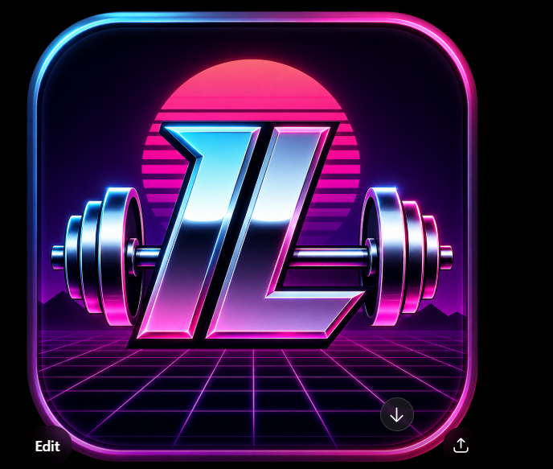
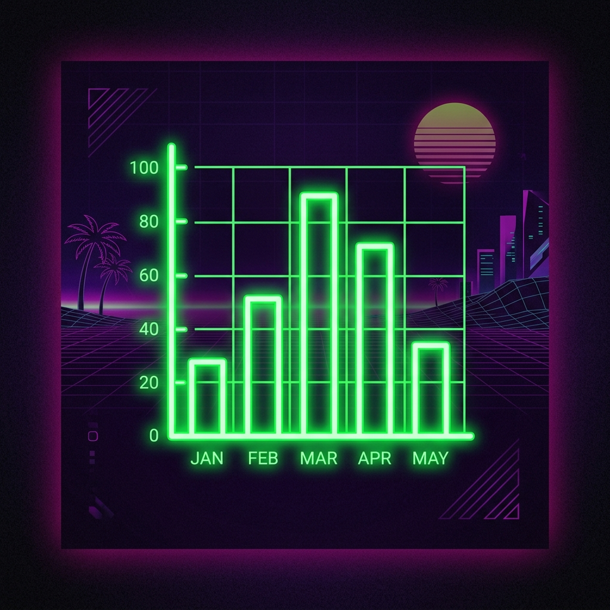
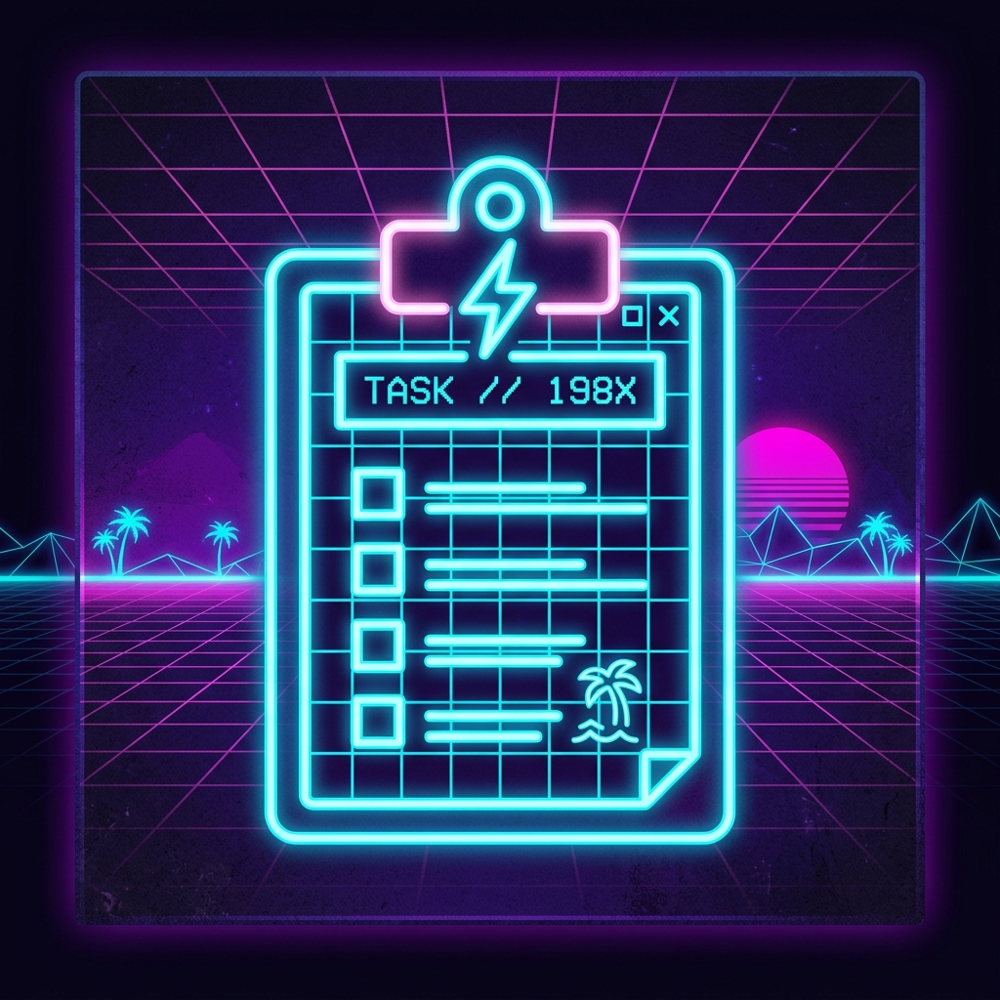
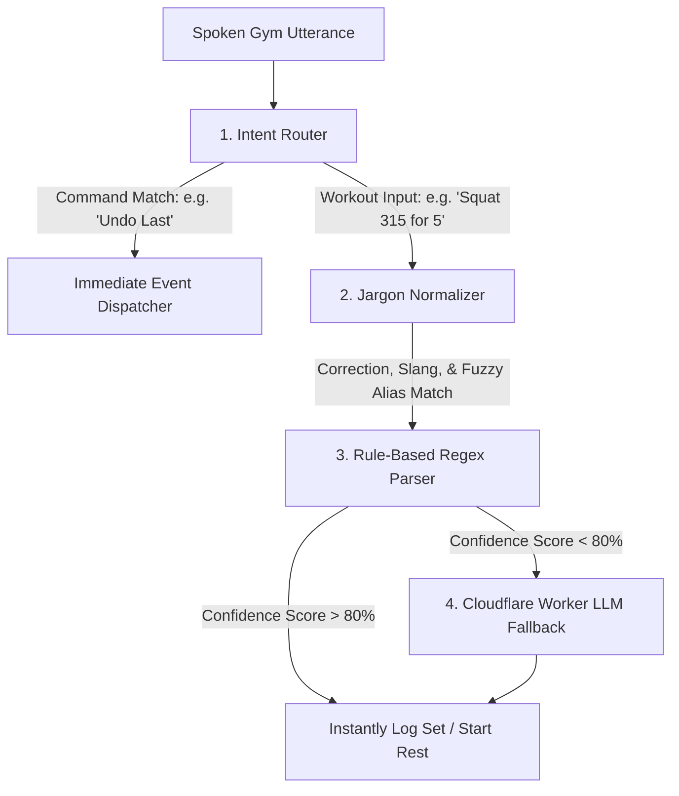

<p align="center">
  
</p>

<h1 align="center">⚡ BODYNET_88 // IronLog ⚡</h1>

<p align="center">
  <strong>An ultra-premium, Vaporwave-themed Progressive Web App (PWA) for strength training.</strong><br />
  Featuring rule-based Natural Language Processing (NLP), dynamic browser DSP synth, and custom binary FIT file encoding.
</p>

<p align="center">
  <a href="https://richhank.github.io/ironlog/"><strong>🌐 Launch Live PWA</strong></a> ·
  <a href="#-engineering-deep-dive"><strong>🧠 Engineering Deep Dive</strong></a> ·
  <a href="#-voice-parser-architecture"><strong>🎙️ Voice NLP Engine</strong></a>
</p>

---

## 📸 Visual Tour

<table align="center">
  <tr>
    <td width="33%" align="center">
      <strong>🏋️ Active Workout (BODYNET_88)</strong><br />
      
    </td>
    <td width="33%" align="center">
      <strong>⏱️ Analog Hardware Rest Timer</strong><br />
      
    </td>
    <td width="33%" align="center">
      <strong>📈 Interactive Stats Dashboard</strong><br />
      
    </td>
  </tr>
  <tr>
    <td width="33%" align="center">
      <strong>📅 Calendar Heatmap Grid</strong><br />
      
    </td>
    <td width="33%" align="center">
      <strong>📜 Chronological Workout Log</strong><br />
      
    </td>
    <td width="33%" align="center">
      <strong>💾 Retro Custom Icons</strong><br />
      
    </td>
  </tr>
</table>

---

## 🧠 Engineering Deep Dive
> [!NOTE]
> **Why Hiring Managers and Tech Leads Love This:** 
> Beyond the nostalgic 80s cyber-grid is an incredibly optimized, zero-runtime-dependency architecture. Every complex subsystem—from compiling Garmin binary data, to state management, audio synthesis, and rule-based parsing—was hand-rolled from scratch rather than lazily calling bloated third-party NPM packages.

### 1. Hardcore Offline-First Storage Engine
Mobile browsers (especially iOS Safari) aggressively evict `localStorage` when memory gets tight. To build a robust, production-grade tracking experience:
- **Dual-Write Architecture**: Every transaction (logging a set, updating a bodyweight, starting/stopping a session) is dual-written to both standard `localStorage` and `IndexedDB`.
- **Automatic Sync & Recovery**: On application boot, the engine validates consistency between both storage systems and auto-heals any corrupted/evicted storage chunks, ensuring 100% data preservation even under aggressive OS eviction policies.
- **Zero Workbox Service Worker**: Hand-written service worker (`sw.js`) with custom Cache-First logic for local assets and build-ID-based cache invalidation, letting the PWA function perfectly deep in a concrete gym basement.

### 2. Hand-Rolled Garmin FIT Binary Encoder (`fit.ts`)
Instead of integrating a multi-megabyte SDK, I reverse-engineered the **Garmin Flexible and Interoperable Data Transfer (FIT) Protocol** and built a custom, lightweight binary encoder:
- Directly writes `FIT` headers, file definitions, and data records matching the official Garmin SDK Profile 21.x schema in binary format.
- Packs and encodes timestamp offsets, GPS data placeholders, and exercise-specific fields (weights, repetitions) into standard byte streams.
- Exposes native Web Share API triggers to let users seamlessly push `.fit` workouts directly into **Garmin Connect** or native mobile health ecosystems without server-side processing.

### 3. Dynamic DSP Browser Synth (`audio.ts`)
Downloading audio assets for an interactive UI would bloat the PWA bundle and ruin initial page-load performance. To overcome this, **BODYNET_88 Synthesizes 100% of its UI audio dynamically inside the browser**:
- **0-Byte Asset Footprint**: Audio files are non-existent. Instead, it utilizes the native browser **Web Audio API** (`AudioContext`).
- **Nostalgic 80s Waveforms**: Generates customized physical click and chime feedback using custom frequency envelopes, Low-Pass filter sweeps, and dual-oscillator FM synthesis.
- **Piezo Alarm Buzzer**: Recreates the classic, high-frequency piezo buzzers of retro digital alarm clocks for the rest timer, bypassing background CPU throttling to wake the user.

---

## 🎙️ Voice Parser Architecture

<p align="center">
  
</p>

The speech-to-workout parsing utilizes a localized, highly-customized **3-stage natural language processing (NLP)** pipeline before calling an AI fallback:



1. **The Intent Router (`voiceCommands.ts`)**: Runs a battery of 14 rule-based classifiers to determine the primary intent of the utterance (such as starting a routine, toggling the timer, triggering haptics, or logging a specific set).
2. **Jargon Normalizer (`voiceJargon.ts`)**: Operates a 4-stage textual pipeline to filter gym slang. Translates abbreviations like `"to failure"` to `"AMRAP"`, `"@8"` to `"RPE 8"`, and runs **Levenshtein Distance fuzzy-matching** to match phonetic speech recognition mistakes against the pre-loaded dictionary of 90+ exercises.
3. **Regex Rule Parser (`parser.ts`)**: Hand-crafted grammar rules extract weights, reps, and sets. Handles advanced notations such as `"3 sets of 10 at 185"`, `"135 times 15 rep"`, and warm-up set notation.
4. **Cloudflare Worker LLM Fallback (`aiParser.ts`)**: If confidence is low, a secure CORS request is dispatched to a Cloudflare Worker running an LLM that accepts full context and formats the parsed response into structured JSON.

---

## 🛠️ Technical Stack & Architecture

| Layer | Technologies Used | Key Custom Implementations |
|---|---|---|
| **Core Architecture** | React 18, TypeScript (Strict-mode) | Hand-rolled custom hooks, unified state machine |
| **Styling & Theme** | Tailwind CSS 3.4, Vanilla CSS | CSS CRT Scanlines, custom `@keyframes` glassmorphism glow |
| **Storage Engine** | LocalStorage + IndexedDB API | Custom multi-layer backup, JSON & CSV exporting/importing |
| **Voice Processing** | Web Speech API (`SpeechRecognition`) | Automatic silence triggers, fuzzy-matching jargon algorithms |
| **Hardware Access** | Wake Lock API, Vibration API | Custom video fallbacks for iOS screens, physical click haptics |
| **Integrations** | Cloudflare Workers, Strava API OAuth | Secure OAuth proxying keeping secrets completely off-client |

---

## 📁 Project Directory Map

```
src/
  App.tsx                     Root router, state coordination, & active session controller
  types.ts                    Type definitions guarding core workout structures
  storage.ts                  Advanced Dual-write local & IndexedDB sync layer
  audio.ts                    Pure JS synth generating retro 80s UI chimes & clock alarms
  fit.ts                      Custom Garmin FIT byte-level binary encoder
  share.ts                    PWA native share sheet broker with local download fallback
  strava.ts                   Strava OAuth Client & token auto-refresh manager
  voice.ts                    SpeechRecognition wrapper with adaptive silence detection
  components/                 Modular PWA UI views (Analytics, Calendar Heatmap, RestTimer)
  hooks/                      Utility hooks (Wake Lock, Rest Timer, iOS standalone detection)
worker/                       Cloudflare Worker broker proxying Strava's OAuth client_secret
public/                       Pre-cached offline static assets, fonts, & PWA Manifest
```

---

## 🚀 Running Locally

Clone the repository and install dependencies:
```bash
git clone https://github.com/RichHank/ironlog.git
cd ironlog
npm install
```

Start the Vite development hot-reloading server:
```bash
npm run dev
```

Build and test production assets locally:
```bash
npm run build
npm run preview
```

Deploy your changes directly to GitHub Pages:
```bash
npx gh-pages -d dist -m "Deploy: Manual Build Update"
```

---

## 🛡️ Security Integrity
- **CORS Restricted CSP**: Employs a strict Content Security Policy limiting scripts, frames, and connect points strictly to safe domains.
- **Serverless Secret Brokerage**: The client code does **not** store any OAuth `client_secret` variables. All sensitive token operations are proxied through a separate serverless Cloudflare Worker (`worker/src/index.ts`) using hidden environment secrets.

---

<p align="center">
  <strong>BODYNET_88 // IronLog</strong> — Engineered with absolute passion for visual excellence and optimal front-end performance.
</p>
